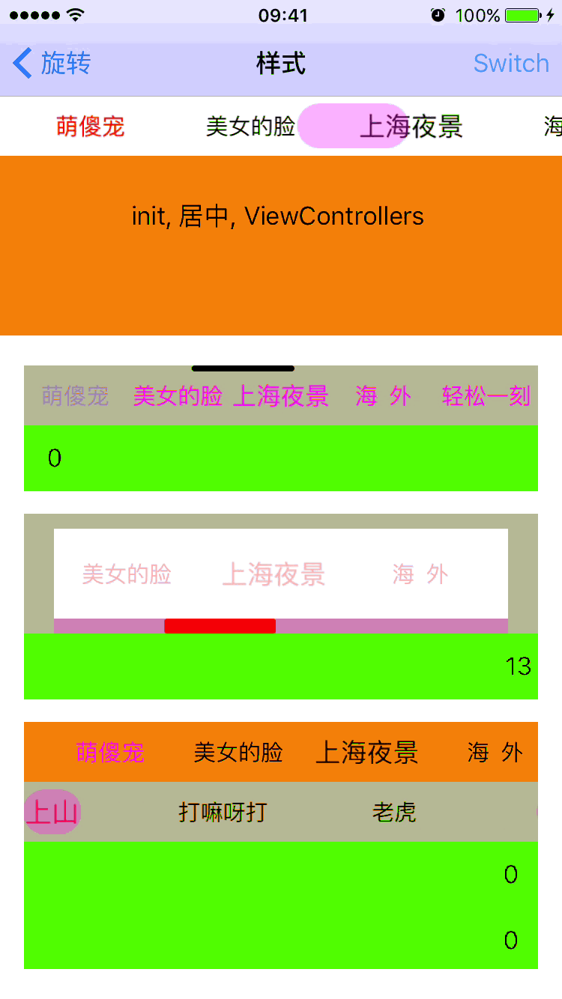
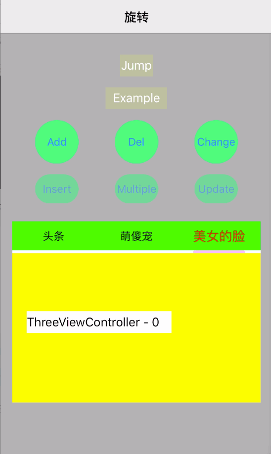
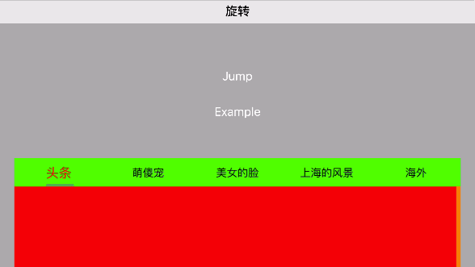

# YFLinkageScroll


多 UIScrollView 联动

<p align="left" >
  
</p>


##Introduction
1. 按钮(颜色,大小缩放)
2. 滑块类型: 自定义颜色高,宽度跟btn.titile宽度+参数
3. 内容(UIViewcontroller, UIView) 
4. 旋转, 横屏标签显示数量默认为竖屏的2倍或最大数
5. CRUD 增删改查功能, 或CRUD后直接和原始的进行对比看网易新闻
<p align="left" >


</p>

##Usage
**Xib加载 或代码 alloc.init 后** <p></p>
**配置方法,属性或block, 事件代理(左右滑出界,停止滚动时的当前页)**<p></p>
```
/**
 *  初始化
 *  缩放1.2  
 *  slider按tagArr的title字符宽度
 */
- (void)configWithScrolltagArray:(NSArray *)tagArr
                    visibleCount:(float)visibleCount
                      sliderType:(YFSliderType)type
               contentScrollItem:(NSArray *)contentArr;
```
```               
/**
 *  自定义初始化
 */
- (void)configWithScrolltagArray:(NSArray *)tagArr
              tagScrollEdgeInset:(UIEdgeInsets)tagEdge
                        tagScale:(CGFloat)tagScale
              configTagItemBlock:(YFTagItemConfigration)block
                    visibleCount:(float)visibleCount
                      sliderType:(YFSliderType)type
                    customSlider:(UIView *)customSlider
               contentScrollItem:(NSArray *)contentArr;
```               
               
##License
This project is under MIT License. See LICENSE file for more information.
